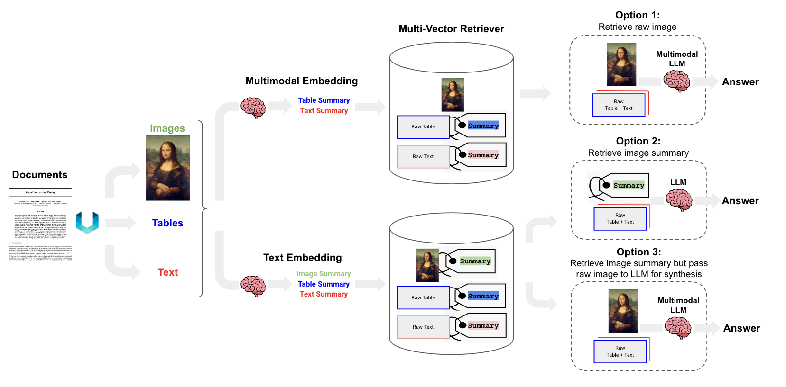

# Advanced RAG

## References

### Advanced RAG Eval

https://github.com/langchain-ai/langchain/blob/master/cookbook/advanced_rag_eval.ipynb

### Semi-structured RAG

https://github.com/langchain-ai/langchain/blob/master/cookbook/Semi_Structured_RAG.ipynb

### Semi-structured and Multi-modal RAG

https://github.com/langchain-ai/langchain/blob/master/cookbook/Semi_structured_and_multi_modal_RAG.ipynb

### llama.cpp

https://github.com/ggerganov/llama.cpp

### ggml_llava-v1.5-7b

https://huggingface.co/mys/ggml_llava-v1.5-7b/tree/main

### Multi-Vector Retriever for RAG on Tables, Text, and Images

https://blog.langchain.dev/semi-structured-multi-modal-rag/

### Multimodal RAG using Langchain Expression Language And GPT4-Vision
https://medium.aiplanet.com/multimodal-rag-using-langchain-expression-language-and-gpt4-vision-8a94c8b02d21

### Ensemble Retriever

https://python.langchain.com/docs/modules/data_connection/retrievers/ensemble

